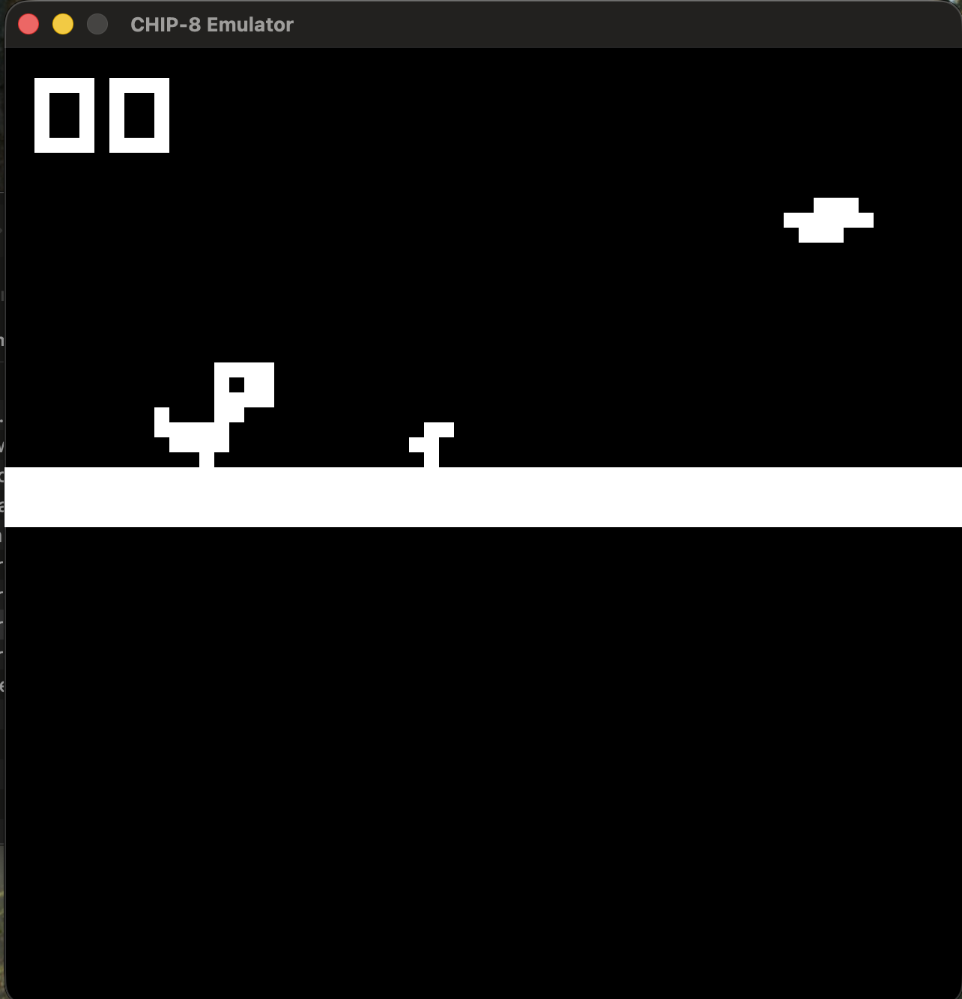

<h1> CHIP-8 Emulator </h1>

This CHIP-8 Emulator is coded in C with Raylib

<h2> Build & Run </h2>
<h3> System Requirements </h3>
- CMAKE >= 3.16
- C-Compiler (gcc, clang)
- Git

<h3> 1. Install Raylib </h3>
bash macOS:

- brew install raylib

<h3> 2. clone repo </h3>

- git clone https://github.com/CyberBratan2069/CHIP-8-Emulator.git

- cd CHIP-8-Emulator

<h3> 3. build on MacOs </h3>
/Applications/CLion.app/Contents/bin/cmake/mac/aarch64/bin/cmake --build "/Users/christianreiswich/CLionProjects/CHIP-8 Emulator/cmake-build-debug" --target CHIP_8_Emulator -j 8

<h3> 4. Start on MacOs </h3>
./cmake-build-debug/CHIP_8_Emulator roms/dinorun.ch8

